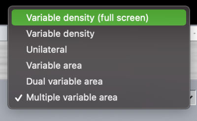
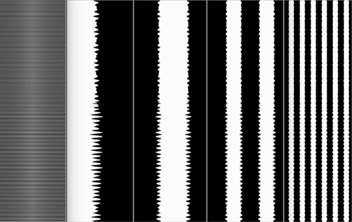

# SpiritsInObjects User Manual

I. [Introduction](#introduction)\
II. [Getting started](#getting_started)\
&nbsp;&nbsp;&nbsp;&nbsp;A. [Creating images and videos](#creating_images_and_videos)\
&nbsp;&nbsp;&nbsp;&nbsp;&nbsp;&nbsp;&nbsp;&nbsp;i. [Formats](#iv_formats)\
&nbsp;&nbsp;&nbsp;&nbsp;&nbsp;&nbsp;&nbsp;&nbsp;ii. [Dimensions](#dimensions)\
&nbsp;&nbsp;&nbsp;&nbsp;&nbsp;&nbsp;&nbsp;&nbsp;iii. [Soundtrack location](#soundtrack_location)\
&nbsp;&nbsp;&nbsp;&nbsp;&nbsp;&nbsp;&nbsp;&nbsp;iv. [Color](#color)\
&nbsp;&nbsp;&nbsp;&nbsp;B. [Creating audio](#creating_audio)\
&nbsp;&nbsp;&nbsp;&nbsp;&nbsp;&nbsp;&nbsp;&nbsp;i. [Formats](#a_formats)\
&nbsp;&nbsp;&nbsp;&nbsp;&nbsp;&nbsp;&nbsp;&nbsp;ii. [MIDI files](#midi_files)\
&nbsp;&nbsp;&nbsp;&nbsp;&nbsp;&nbsp;&nbsp;&nbsp;iii. [Audio files](#audio_files)\
&nbsp;&nbsp;&nbsp;&nbsp;C. [Other details](#other_details)\
&nbsp;&nbsp;&nbsp;&nbsp;&nbsp;&nbsp;&nbsp;&nbsp;i. [Film size and frame rate](#film_size_and_frame_rate)\
&nbsp;&nbsp;&nbsp;&nbsp;&nbsp;&nbsp;&nbsp;&nbsp;ii. [Audio sample rate](#audio_sample_rate)\
III. [Using the application](#using_the_application)\
&nbsp;&nbsp;&nbsp;&nbsp;A. [Composer](#composer)\
&nbsp;&nbsp;&nbsp;&nbsp;&nbsp;&nbsp;&nbsp;&nbsp;i. [Adding images to the Bin](#adding_images_to_the_bin)\
&nbsp;&nbsp;&nbsp;&nbsp;&nbsp;&nbsp;&nbsp;&nbsp;ii. [Creating a Timeline](#creating_a_timeline)\
&nbsp;&nbsp;&nbsp;&nbsp;&nbsp;&nbsp;&nbsp;&nbsp;iii. [Adding images to the Timeline](#adding_images_to_the_timeline)\
&nbsp;&nbsp;&nbsp;&nbsp;&nbsp;&nbsp;&nbsp;&nbsp;iv. [Editing the Timeline](#editing_the_timeline)\
&nbsp;&nbsp;&nbsp;&nbsp;&nbsp;&nbsp;&nbsp;&nbsp;v. [Previewing Timeline video](#previewing_timeline_video)\
&nbsp;&nbsp;&nbsp;&nbsp;&nbsp;&nbsp;&nbsp;&nbsp;vi. [Exporting Timeline video](#exporting_timeline_video)\
&nbsp;&nbsp;&nbsp;&nbsp;B. [Sonify](#sonify)\
&nbsp;&nbsp;&nbsp;&nbsp;&nbsp;&nbsp;&nbsp;&nbsp;i. [Sonifying videos](#sonifying_videos)\
&nbsp;&nbsp;&nbsp;&nbsp;&nbsp;&nbsp;&nbsp;&nbsp;ii. [Sonifying still images](#sonifying_still_images)\
&nbsp;&nbsp;&nbsp;&nbsp;&nbsp;&nbsp;&nbsp;&nbsp;iii. [Previewing audio](#previewing_audio)\
&nbsp;&nbsp;&nbsp;&nbsp;&nbsp;&nbsp;&nbsp;&nbsp;iv. [Exporting audio](#exporting_audio)\
&nbsp;&nbsp;&nbsp;&nbsp;C. [Visualize](#visualize)\
&nbsp;&nbsp;&nbsp;&nbsp;&nbsp;&nbsp;&nbsp;&nbsp;i. [Visualizing MIDI](#visualizing_midi)\
&nbsp;&nbsp;&nbsp;&nbsp;&nbsp;&nbsp;&nbsp;&nbsp;ii. [Visualizing audio](#visualizing_audio)\
&nbsp;&nbsp;&nbsp;&nbsp;&nbsp;&nbsp;&nbsp;&nbsp;iii. [Previewing video](#previewing_video)\
&nbsp;&nbsp;&nbsp;&nbsp;&nbsp;&nbsp;&nbsp;&nbsp;iv.[Exporting video](#exporting_video)\
IV. [Saved Projects](#saved_projects)\
[References](#references)\

## I. Introduction

SpiritsInObjects is a software tool that provides a means for sonifying and sequencing a set of images, sonifying entire videos *and* visualizing MIDI or audio. 
It is meant to aid in the process of creating optical sound films by allowing a user to import a set of images, organize/sequence them onto a timeline in either repeating or unique patterns, listen to the sounds that they produce, and output results in three formats: 

1. Preview playback within the program
2. WAV audio files
3. MOV video files

This manual will guide you through using the SpiritsInObjects program.

## II. Getting started 

#### A. Creating images and videos

**i. Formats**

Videos that are supported by Chromium will be able to be used by the application with no additional rendering: [The Chromium Projects - Audio Video](https://www.chromium.org/audio-video) [[1](#footnote1)].
Videos with ProRes, H.265 or other non-supported encoding will need to be transcoded by the application to be previewed in the GUI.
All videos are processed with a provided `ffmpeg` binary and the application will support any codec allowed by the version in the module [ffmpeg-static](https://www.npmjs.com/package/ffmpeg-static) [[2](#footnote2)].
Videos can be have any of the following extensions: `.avi`, `.mp4`, `.mkv`, `.mpg`, `.mpeg`, `.mov`, `.m4v`, `.ogg`, or `.webm`. 

Image formats supported by the application are PNG, JPEG and non-animated GIF.
JPEG files are allowed with either the `.jpeg` or `.jpg` extension.

**ii. Dimensions**

SpiritsInObjects will accept images and video of any dimensions, but for the purposes of making sound-on-film video, 16:9 is the recommended aspect ratio.
The resolution that will determine audio quality is the height of the image or video, with larger values allowing for higher sample rates.

When creating and importing images for the Composer, note that the largest resolution image of any you include in the Bin will be the resolution of the video you create.
Keep this in mind when adding images.
Unless you have a specific reason for doing otherwise, try to keep all of your images in the same resolution and aspect ratio for use with the Composer.

**iii. Soundtrack location** 

SpiritsInObjects attempts to recreate the sounds that are produced by the optical sound component within 16mm projectors. 
These sound devices work by reading light that passes through the soundtrack portion (the side without the sprocket-holes) of single perf 16mm film. 
SpiritsInObjects only analyzes the right 19% of each image. 
Any visual data to the left of this area is ignored and doesn't affect the sound in any way. 
Therefore, when creating images for use with this program, make sure to note that you will only be hearing the right 19% of each image. 

 

**iv. Color**

SpiritsInObjects does not take color into consideration when analyzing images or videos. 
It only calculates the average, perceptual luminance within the soundtrack portion of the imported pictures. 

#### B. Creating audio

Before using the Visualize tool, make sure the audio files you intend to use are supported by SpiritsInObjects.

**i. Formats**

SpiritsInObjects is capable of visualizing both MIDI and audio files in WAV or MP3 file formats.

**ii. MIDI files**

The MIDI visualization feature can generate videos per track, meaning that if your MIDI file contains several tracks they will have to be visualized separately.
SpiritsInObjects does not synthesize MIDI with default instruments or those located in sound font files, but rather implements its own synthesizer that it applies to any track selected.
This means that all tracks will be synthesized with the same visual instrument.

**iii. Audio files**

Audio files created in mono or single-channel [WAV](https://en.wikipedia.org/wiki/WAV) [[3](#footnote3)] format are supported by default with no need for additional transcoding or mixdown.

All other audio files will be interpreted as mono, single-channel files no matter what is provided to the software.
On opening a multi-channel MP3 or WAV file, the application will mix down and transcode your file to a temporary version stored by the app.

Take this into consideration if you would like to mix down your tracks outside of SpiritsInObjects prior to visualization.
The sample rate of the audio will be resampled to the maximum rate allowed by the height of the video resolution you wish to output.
For reference: if you are generating a 1080P resolution video (in the app labelled 1920×1080) your maximum sample rate will be 25920 Hz or just under 26 kHz.
Higher resolution video, which allows for more visual data along the vertical axis, will allow for higher sample rate audio.

#### C. Other details

**i. Film size and frame rate** 

SpiritsInObjects assumes that your images will end up on 16mm film filmed with a Super16 gate and run through a 16mm projector at 24 frames per second.

**ii. Audio sample rate** 

The audio generated by the Sonify tool and the WAV file that it exports are created at a 48 kHz sampling rate. 

 
## III. Using the application 

SpiritsInObjects is comprised of three tools: **[Composer](#composer)**, **[Sonify](#sonify)** and **[Visualize](#visualize)**.
Each of these different tools are accessible by selecting the corresponding tab at the top of the application.

#### Composer

The Composer allows you to sequence images along a Timeline to create compositions of sounds.
Each cell on the Timeline represents a frame in a sequence of a set length and each frame will be sonified for playback.
The tone generated by a single frame can be added in multiples, sustaining the sound from a single image for multiple frames.
Using this tool you can compose songs from your images.

**i. Adding images to the Bin**

In order to use images within the Composer, they first must be added to the bin.
Image files can be added by dragging them into the application window or by clicking the "Import File" button below the Bin.

Once added, the images will be listed in the order they were added.
Each image file will have a "Key" associated to it, labelled in the left-hand column.
This is the key on the keyboard that can be pressed to play the sonification of the image.
Holding the key will play it continuously.

Clicking on an image will select it and display it in the Composer preview window.

**ii. Creating a Timeline**

In order to create a sequence within the Composer, you must create a Timeline of a specified length.
Click the "New Timeline" button on the right of the app and a prompt will appear asking for the length of the new Timeline, in frames.

The default value supplied is 255, which is roughly 10.6 seconds played back at 24 FPS.
Timelines that are 4000 frame long will fill exactly 100 feet or 30.48 meters of 16mm film.

**iii. Adding images to the Timeline**

To sequence images on the Timeline you can drag them from the Bin or by clicking the "Add # Frame(s) to Timeline" button.
Dragging them from the bin will result in a green highlighted preview of where the image or images will be placed.
The key of the image will appear within the frame cell while previewing and then remain after being dropped there.

To add multiple images to Timeline, change the value in the number input element between the "Import File" and "Add 1 Frame to Timeline" buttons.
Changing this number to 4 will update the button to the right to say "Add 4 Frames to Timeline".
The next time frames are added to the Timeline, they will be added in multiples of 4.

The cursor, highlighted on the Timeline in yellow, marks the position at which you are editing.
If a frame is highlighted, any image added to the Timeline by clicking or pressing the "Add # Frame(s) to Timeline" button will be added at the selected frame.
If multiples of an image are added they will overwrite frames after the cursor.
After an image or multiple images are added the cursor will move to the following frame in the Timeline if it hasn't already reached the end.

**iv. Editing the Timeline**

The timeline can be edited by dragging and dropping selected frames or by cutting and pasting them.
Similar to text editing applications, pressing `Ctrl-C` or `Apple-C` will copy a highlighted or group of selected frames.
Key combinations `Ctrl-X` or `Apple-X` will cut a highlighted frame or group of selected frames.
Finally, `Ctrl-P` or `Apple-P` will paste copied or cut frames at the cursor location.

Multiple frames can be selected by clicking and placing the cursor on the first or last frame you want selected and then holding `Shift` while selecting the last or first frame you want selected.
Everything in your selection will be highlighted in green.

The cursor can also be moved with the arrow keys `left` and `right` on your keyboard.
The current selected frame number will appear in the frame counter above the preview window.

Deleting images from the Timeline will remove the contents of a frame highlighted by the cursor.
It will then move to the previous frame if there is one or remain at the first frame once it is reached.

**v. Previewing Timeline video**

At any point while editing your Timeline you can generate a preview by pressing the play button under the preview window.
A loading spinner will appear in the button for the length of time it takes to render a preview video.
If the Timeline has been changed since the last preview was created it will have to regenerate a new video.

The preview can be looped and this setting can be changed by clicking the toggle button that is labelled "Loop: OFF" by default.
Clicking the button will cause it to enable looping and change the text of the button to "Loop: ON".
Clicking it again will disable looping and toggle the label back to "Loop: OFF".

**vi. Exporting Timeline video**

Videos of the current state of the Timeline can be exported by clicking the "Export Timeline" button on the right side of the screen.
This will pause the application interface until the export process completes.

Videos exported from the Composer view come in a `.mov` [QuickTime](https://en.wikipedia.org/wiki/QuickTime_File_Format) [[4](#footnote4)] container and are encoded as [Apple ProRes 422 HQ](https://www.apple.com/final-cut-pro/docs/Apple_ProRes_White_Paper.pdf) [[5](#footnote5)].

**Note:** The video will be exported at the resolution of the largest image in the Bin, as mentioned in the [Dimensions](#dimensions) section.
If your Timeline consists of only 1920×1080 images and your bin contains a single 2560×1440 file, your images will all be scaled to 2560×1440 as will the resulting video.

#### Sonify

The Sonify window, accessed by selecting the "Sonify" tab at the top of the app, allows you to turn a video or still image into playable sound as it would were it film running through a 16mm projector.
Importing a video or image file into this tool will allow you to listen to your images and explore videos frame by frame and previewing how they will sound.

**i. Sonifying videos**

Videos can be sonified, previewed and exported by first dragging them from your operating system file browser or desktop into the application.
If no file is selected, as when first opening the app, you can also open a file dialog by clicking on the area with the text "Select or drag an image or video to sonify".

When loaded, a video's end timecode will be displayed in the top right hand corner of the app in `00:00:00;00` format.

The area of the image marked by the two red lines marking the right-most 19% of the image highlights the part of the image that is being sonified.

**ii. Sonifying still images**

Still images can be sonified with a similar process.
Dragging an image of JPEG or PNG file types will load them into the preview window and allow you to preview the audio of it as if it were a single frame video.

**Note:** When exporting the audio of a single frame the resulting audio file will be only 0.042 seconds or 42 milliseconds long.

**iii. Previewing audio**

Pressing the `F` key on your keyboard will play the audio interpreted from that frame.
When using a video, scrubbing along the timeline will change the count in the frame counter located above the preview window.

Scrubbing through a video can be done by clicking the timeline or dragging the cursor.
Frame by frame scrubbing can be accomplished by pressing the "Prev Frame" and "Next Frame" arrow buttons on either side of the play button.
The timeline can also be scrubbed a single frame at a time using the `left` and `right` keys on your keyboard.

The entirety of a video can be previewed by pressing the play button.
This will pause the application interface while a preview audio file is rendered.
The amount of time this will take depends on the length and resolution of your video, longer and higher resolution videos taking more time to interpret and generate audio from.
Once this preview file has been rendered it will not have to be re-rendered until the selected file changes in the Sonify tool.

**iv. Exporting audio**

An audio file of your video or still image can be created by clicking the "Sonify Video" button.
This will pause the application interface while an audio file is rendered.
Once the process is complete a file dialog will open and ask you where you want to save your new audio file.
The format of the file is WAV and the application will append a `.wav` extension on your file if you do not give it a `.wav` or `.wave` file extension in the save dialog.

#### Visualize

The Visualize tool enables you to create visualizations of a MIDI or audio file that, when committed to 16mm film, will produce sound when played in a 16mm projector.
The application does this by generating images that represent notes in MIDI files or by interpreting audio sample data using the [SoundtrackOptical.js](https://github.com/sixteenmillimeter/SoundtrackOptical.js) [[6](#footnote6)] library.

**i. Visualizing MIDI**

MIDI files can be visualized, previewed and exported to video by first dragging them from your operating system's file browser or desktop into the application.
If no file is selected, as when first opening the app, you can also open a file dialog by clicking on the area with the text "Select or drag a MIDI or audio file to visualize".

Once loaded, frames will be generated for the first track by default.
The preview will jump ahead in the Visualize timeline to the first rendered note.

The total length of the video that is to be generated by the Visualize tool can be verified by looking in the top right corner of the application where the end timecode is printed in `00:00:00;00` format.

The video's resolution is shown in the dropdown element at the top of the application window, to the right of the frame counter.
By default it is set to 1920×1080 but can be set to other 16:9 video formats up to 3840×2160.
Changing this value will cause your preview video to re-render at the new resolution.

Different tracks can be selected in the dropdown that appears below the preview window.
Labelled "Track #, Instrument [#]" the different tracks in your MIDI file will all be presented as options with their instrument name and ID number.
Changing the selection in this dropdown will cause your preview window to render the newly-chosen track.

The MIDI audio can be represented with "Square Wave" (the default) bars representing the tone of a note or "Sine Wave" gradients.
Changing this value triggers a re-render of the preview.
This will change the quality of the sound.

The offset of the image from the soundtrack area can be changed.
By default the "No offset" option is selected, meaning your generated image will run continuously from the 16mm image area through the soundtrack.
If you were to take this video and print it perfectly onto single perf 16mm film and play it using a projector, the audio would lag the image by 26 frames, slightly over a second.
This is because the optical soundtrack reader on a 16mm projector sits 26 frames after the projection gate, so the image is shown before corresponding soundtrack data is read by the optical head.

To counteract this, select the "Offset 26 frames" option which will advance the generated imagery in the audio track by 26 frames and display blank frames until the audio and picture are in sync.
It will create a split view where the right 19% of the image differs from what is shown on the left 81%.

**ii. Visualizing audio**

Similar to MIDI files, standard audio can also be visualized to soundtrack data that when committed to film and played in a 16mm projector produces a facsimile of the original audio.
SpiritsInObjects gives you the ability to generate images that extend the entire width of the film--using the "Variable density (full screen)" option--or to create more traditional soundtracks of different types that sit only in the soundtrack area.

When using the "Variable density (full screen)" soundtrack type, the sample data of your audio file will appear stretched completely across the 16:9 frame at different densities that mimic the standard variable density soundtracks produced for 16mm films.

 

Similar to visualizing a MIDI file, you can select an offset option which will advance the imagery in the soundtrack area 26 frame ahead of the images in the picture area.

When using the other types of soundtracks, imagery representing the sound will only appear in the right 19% of the frame which is the soundtrack area.
These types are "Variable Density", "Unilateral", "Variable Area", "Dual Variable Area" and "Multiple Variable Area".

These different types are detailed more completely in the original Processing library that SoundtrackOptical.js was based on, [SoundtrackOptical](https://github.com/sixteenmillimeter/SoundtrackOptical) [[7](#footnote7)] and in [a guide created by Paul Ivester](http://www.paulivester.com/films/filmstock/guide.htm) [[8](#footnote8)].

**iii. Previewing video**

Preview the visualization of your audio by pressing the play button below the preview window.
This will pause the application interface while the preview video is rendered.
Because these images are generated based on your settings, anytime you change a setting such as the selected track, the wave style, the soundtrack type or the offset the application must create a new preview.

**iv. Exporting video**

Similar to the Composer, the video exported by the Visualize tool is a Quicktime `.mov` file with ProRes encoding.
Click the "Export Video" button to begin exporting.
This will pause the application interface while the video is being rendered.
Once this is complete you will be presented with a file dialog for you to choose a name and location for this new video.

## IV. Saved Projects

Your work can be saved as a `.sio` file by pressing `Ctrl-S`, `Apple-S` or by selecting "Save" under the "File" menue=.
These files can be restored by opening them with `Ctrl-O` or `Apple-O` and selecting the file.
Project files can also be dragged and dropped onto the application to open them.

Saved .sio files are JSON documents that are readable and editable with any text editor.
Corrupting or altering the structure of the JSON object which store application state may cause SpiritsInObjects to fail to load your file correctly. Otherwise, these files may be read, altered or generated by other applications.

**Note:** Opening or dropping a save file into the application while you have unsaved changes will overwrite them.
This may cause you to lose work if you have not already saved your work in another `.sio` file.

##### References

1. The Chromium Project - Audio Video | [https://www.chromium.org/audio-video](https://www.chromium.org/audio-video)
2. npm - ffmpeg-static | [https://www.npmjs.com/package/ffmpeg-static](https://www.npmjs.com/package/ffmpeg-static)
3. Wikipedia - WAV | [https://en.wikipedia.org/wiki/WAV](https://en.wikipedia.org/wiki/WAV)
4. Wikipedia - QuickTime File Format | [https://en.wikipedia.org/wiki/QuickTime_File_Format](https://en.wikipedia.org/wiki/QuickTime_File_Format)
5. Apple.com - Apple ProRes, White Paper | [https://www.apple.com/final-cut-pro/docs/Apple_ProRes_White_Paper.pdf](https://www.apple.com/final-cut-pro/docs/Apple_ProRes_White_Paper.pdf)
6. Github - sixteenmillimeter/SoundtrackOptical.js | [https://github.com/sixteenmillimeter/SoundtrackOptical.js](https://github.com/sixteenmillimeter/SoundtrackOptical.js)
7. Github - sixteenmillimeter/SoundtrackOptical | [https://github.com/sixteenmillimeter/SoundtrackOptical](https://github.com/sixteenmillimeter/SoundtrackOptical)
8. Paul's 16mm Film Collecting Pages - Guide to Identifying Color Movie Film Stocks | [http://www.paulivester.com/films/filmstock/guide.htm](http://www.paulivester.com/films/filmstock/guide.htm)